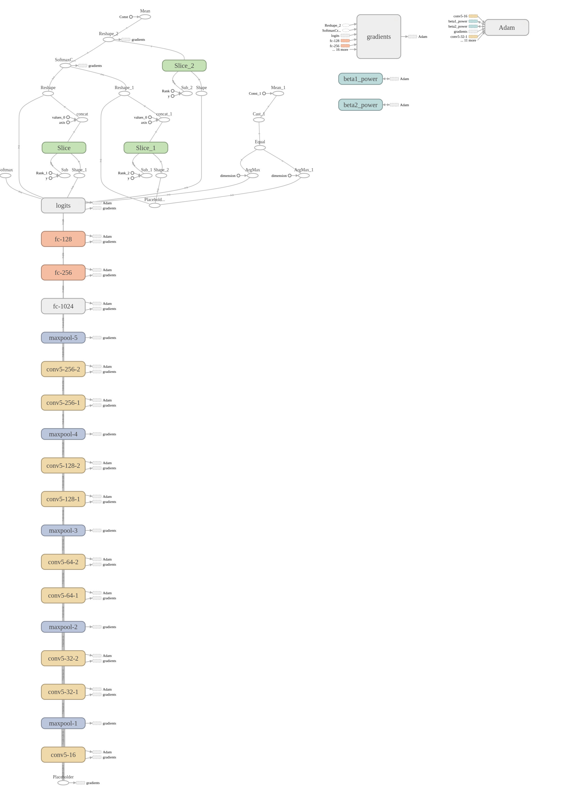

# Vandalism-Detection
Application of SSD Tensorflow to detect probability density for person

Model for our vandalism detection


# This model only able to train vandalism applications, cannot improve SSD accuracy.

## Step to train
1. Unzip both positive.zip and negative.zip in current directory. You may delete the pictures inside it and add more
2. run the script
```bash
python train.py
```
but you may check the settings.py first if got memory error on your GPU
```python
picture_dimension = 128
learning_rate = 0.001
batch_size = 32
epoch = 15
```

## Step to test
1. Complete train above or simply download pretrained model from here
2. Download SSD pretrained model here, create directory called 'checkpoint_ssd' and put in there
3. run the script
```bash
python test_detect.py
```
